# Lab 4 — Linux User, Group & Permission Management

## Objective
Practice Linux user and group management by creating, modifying, and removing accounts, assigning permissions, and controlling sudo access to simulate security and breach scenarios.

## Environment
- Host OS: Windows  
- Hypervisor: VirtualBox  
- Guest OS: Linux  
- Network Mode: NAT  

## Tools Used
- Linux Terminal
- sudo
- visudo
- useradd / adduser
- usermod
- groupadd
- gpasswd
- userdel
- /etc/passwd
- /etc/group

## What I Built
- Created multiple user accounts
- Assigned and modified passwords
- Created and deleted groups
- Granted and revoked sudo privileges
- Simulated a breach using an unauthorized user
- Removed compromised users
- Restored system control using group-based permissions

## Breach Simulation
- Created a malicious user (black_widow)
- Gained unauthorized sudo privileges
- Added and deleted users
- Used a privileged group (magic) to restore control
- Removed attacker from sudo access
- Deleted unauthorized accounts
- Cleaned up privileged groups

## Outcome
Successfully created, modified, and secured multiple user accounts and groups. I was able to detect, control, and remove an unauthorized user using Linux privilege management.

## Reflection
This lab showed how dangerous sudo access can be if misconfigured and how Linux groups and permissions can be used to regain control after a breach. I also learned the difference between adduser and useradd, including how home directories are created.

---

## Screenshots

### User Creation & Configuration
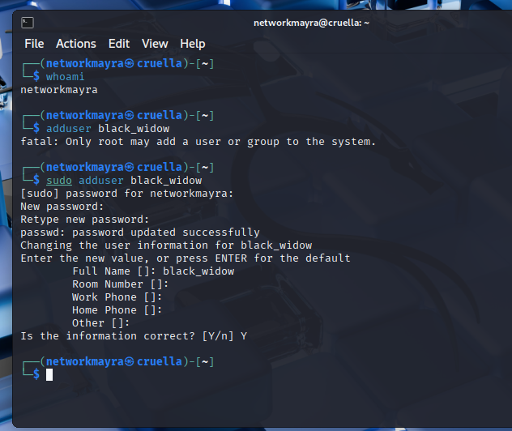
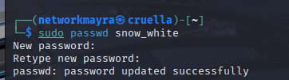
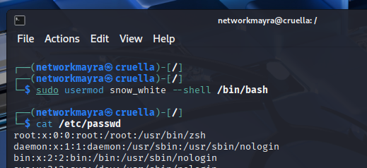

### System Audit
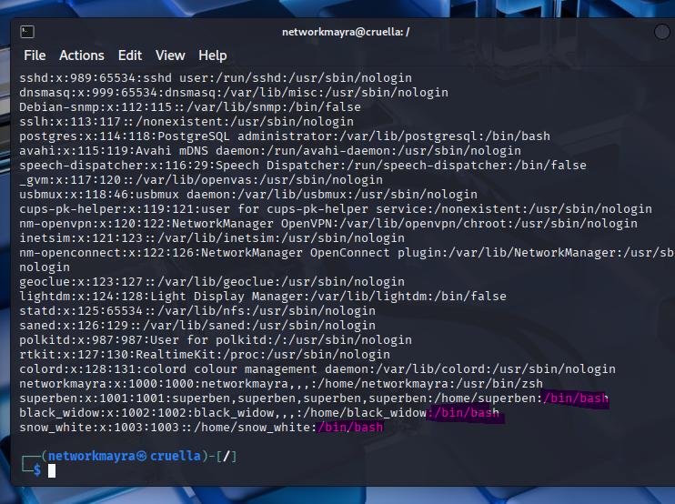
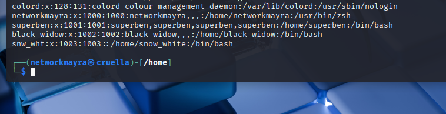

### Privilege Management
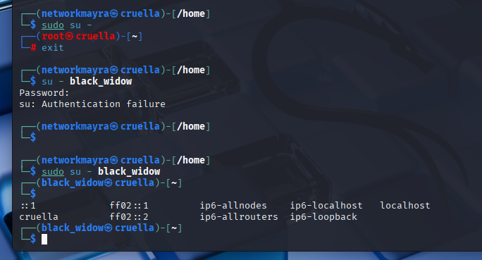
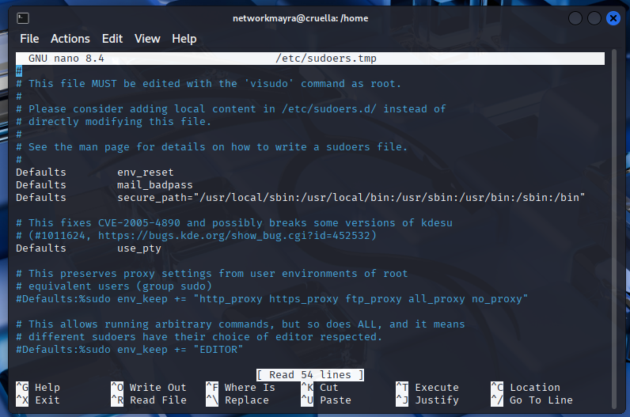
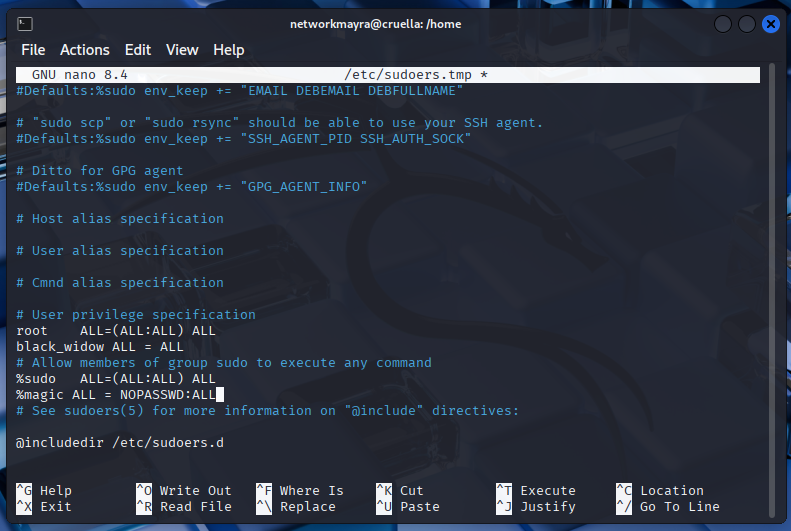

### Filesystem & Group Management
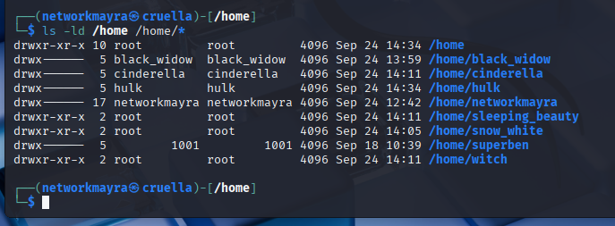
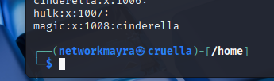
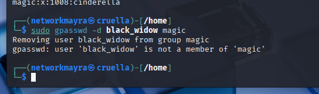

### Incident Cleanup & Final Verification
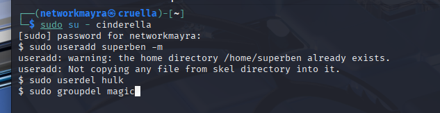
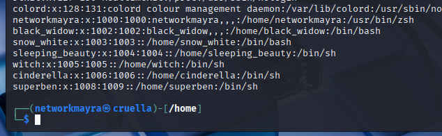
